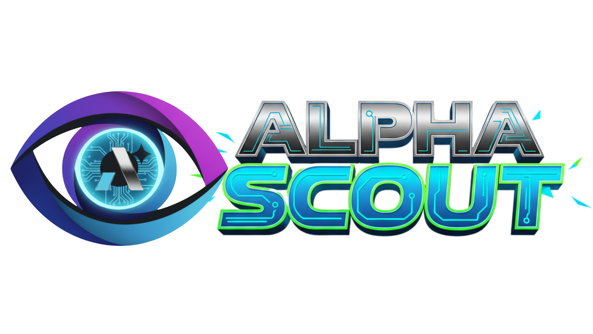

<h1 align="center">
    <br>
</h1>


<div align="center">

[](https://github.com/alphasine)
[](https://x.com/alphasine)
[](https://discord.gg/NN3ABHggMK)
[](https://deepwiki.com/alphasine/alphascout)
[](https://github.com/sponsors/alexchenzl)

</div>

## 🌐 AlphaScout

AlphaScout is an open-source AI web automation tool that runs in your browser. A free alternative to OpenAI Operator with flexible LLM options and multi-agent system.

⬇️ Get [AlphaScout from Chrome Web Store](https://chromewebstore.google.com/detail/TBD) (listing pending review)

👏 Join the community in [Discord](https://discord.gg/NN3ABHggMK) | [X](https://x.com/alphasine)

🌟 Loving AlphaScout? Give us a star  and help spread the word!

❤️ Support the project by [sponsoring us](https://github.com/sponsors/alexchenzl) - every contribution helps keep AlphaScout free and open source!

<div align="center">

<p><em>AlphaScout's multi-agent system analyzing HuggingFace in real-time, with the Planner intelligently self-correcting when encountering obstacles and dynamically instructing the Navigator to adjust its approach—all running locally in your browser.</em></p>
</div>

## 🔥Why AlphaScout?

Looking for a powerful AI browser agent without the $200/month price tag of OpenAI Operator? **AlphaScout** , as a chrome extension, delivers premium web automation capabilities while keeping you in complete control:

- **100% Free** - No subscription fees or hidden costs. Just install and use your own API keys, and you only pay what you use with your own API keys.
- **Privacy-Focused** - Everything runs in your local browser. Your credentials stay with you, never shared with any cloud service.
- **Flexible LLM Options** - Connect to your preferred LLM providers with the freedom to choose different models for different agents.
- **Fully Open Source** - Complete transparency in how your browser is automated. No black boxes or hidden processes.

> **Note:** During the AlphaScout preview only Google Gemini and Groq connectors are available. Support for additional providers will return in future releases.


## 📊 Key Features

- **Multi-agent System**: Specialized AI agents collaborate to accomplish complex web workflows
- **Interactive Side Panel**: Intuitive chat interface with real-time status updates
- **Task Automation**: Seamlessly automate repetitive web automation tasks across websites
- **Follow-up Questions**: Ask contextual follow-up questions about completed tasks
- **Conversation History**: Easily access and manage your AI agent interaction history
- **Multiple LLM Support**: Connect your preferred LLM providers and assign different models to different agents


## 🌐 Browser Support

**Officially Supported:**
- **Chrome** - Full support with all features
- **Edge** - Full support with all features

**Not Supported:**
- Firefox, Safari, and other Chromium variants (Opera, Arc, etc.)

> **Note**: While AlphaScout may function on other Chromium-based browsers, we recommend using Chrome or Edge for the best experience and guaranteed compatibility.


## 🚀 Quick Start

1. **Install from Chrome Web Store** (Stable Version):
   * Visit the [AlphaScout Chrome Web Store page](https://chromewebstore.google.com/detail/alphascout/imbddededgmcgfhfpcjmijokokekbkal)
   * Click "Add to Chrome" button
   * Confirm the installation when prompted

> **Important Note**: For latest features, install from ["Manually Install Latest Version"](#-manually-install-latest-version) below, as Chrome Web Store version may be delayed due to review process.

2. **Configure Agent Models**:
   * Click the AlphaScout icon in your toolbar to open the sidebar
   * Click the `Settings` icon (top right)
   * Add your LLM API keys
   * Choose which model to use for different agents (Navigator, Planner)

## 🔧 Manually Install Latest Version

To get the most recent version with all the latest features:

1. **Download**
    * Download the latest `alphascout.zip` file from the official GitHub [release page](https://github.com/alphasine/AlphaScout/releases).

2. **Install**:
    * Unzip `alphascout.zip`.
    * Open `chrome://extensions/` in Chrome
    * Enable `Developer mode` (top right)
    * Click `Load unpacked` (top left)
    * Select the unzipped `alphascout` folder.

3. **Configure Agent Models**
    * Click the AlphaScout icon in your toolbar to open the sidebar
    * Click the `Settings` icon (top right).
    * Add your LLM API keys.
    * Choose which model to use for different agents (Navigator, Planner)

4. **Upgrading**:
    * Download the latest `alphascout.zip` file from the release page.
    * Unzip and replace your existing AlphaScout files with the new ones.
    * Go to `chrome://extensions/` in Chrome and click the refresh icon on the AlphaScout card.

## 🛠️ Build from Source

If you prefer to build AlphaScout yourself, follow these steps:

1. **Prerequisites**:
   * [Node.js](https://nodejs.org/) (v22.12.0 or higher)
   * [pnpm](https://pnpm.io/installation) (v9.15.1 or higher)

2. **Clone the Repository**:
   ```bash
   git clone https://github.com/alphasine/AlphaScout.git
   cd AlphaScout
   ```

3. **Install Dependencies**:
   ```bash
   pnpm install
   ```

4. **Build the Extension**:
   ```bash
   pnpm build
   ```

5. **Load the Extension**:
   * The built extension will be in the `dist` directory
   * Follow the installation steps from the Manually Install section to load the extension into your browser

6. **Development Mode** (optional):
   ```bash
   pnpm dev
   ```

## 🤖 Choosing Your Models

AlphaScout currently ships with two connectors:

- **Google Gemini** (API key required)
- **Groq** (API key required)

You can mix and match these providers per agent. Here are two quick presets:

### Balanced Setup
- **Planner**: Gemini 2.5 Pro — best reasoning and long-context planning.
- **Navigator**: Groq Llama-3.3 70B Versatile — fast browser interaction with low latency.

### Lightweight Setup
- **Planner**: Gemini 2.5 Flash — cost-effective plan generation.
- **Navigator**: Groq Llama-3.1 8B (or the smallest Llama-3.3 variant) — optimized for inexpensive navigation steps.

> **Tip:** Share working combos in [Discord](https://discord.gg/NN3ABHggMK) so we can document them as more users experiment. Once additional providers return, we’ll expand this section with broader guidance.

## 💡 See It In Action

Here are some powerful tasks you can accomplish with just a sentence:

1. **News Summary**:
   > "Go to TechCrunch and extract top 10 headlines from the last 24 hours"

2. **GitHub Research**:
   > "Look for the trending Python repositories on GitHub with most stars"

3. **Shopping Research**:
   > "Find a portable Bluetooth speaker on Amazon with a water-resistant design, under $50. It should have a minimum battery life of 10 hours"

## 🛠️ Roadmap

We're actively developing AlphaScout with exciting features on the horizon, welcome to join us! 

Check out our detailed roadmap and upcoming features in our [GitHub Discussions](https://github.com/alphascout/alphascout/discussions/85). 

## 🤝 Contributing

**We need your help to make AlphaScout even better!**  Contributions of all kinds are welcome:

*  **Share Prompts & Use Cases** 
   * Join our [Discord server](https://discord.gg/NN3ABHggMK).
   * share how you're using AlphaScout.  Help us build a library of useful prompts and real-world use cases.
*  **Provide Feedback** 
   * Try AlphaScout and give us feedback on its performance or suggest improvements in our [Discord server](https://discord.gg/NN3ABHggMK).
* **Contribute Code**
   * Check out our [CONTRIBUTING.md](CONTRIBUTING.md) for guidelines on how to contribute code to the project.
   * Submit pull requests for bug fixes, features, or documentation improvements.


We believe in the power of open source and community collaboration.  Join us in building the future of web automation!


## 🔒 Security

If you discover a security vulnerability, please **DO NOT** disclose it publicly through issues, pull requests, or discussions.

Instead, please create a [GitHub Security Advisory](https://github.com/alphascout/alphascout/security/advisories/new) to report the vulnerability responsibly. This allows us to address the issue before it's publicly disclosed.

We appreciate your help in keeping AlphaScout and its users safe!

## 💬 Community

Join our growing community of developers and users:

- [Discord](https://discord.gg/NN3ABHggMK) - Chat with team and community
- [Twitter](https://x.com/alphasine) - Follow for updates and announcements
- [GitHub Discussions](https://github.com/alphascout/alphascout/discussions) - Share ideas and ask questions

## 👏 Acknowledgments

AlphaScout builds on top of other awesome open-source projects:

- [Browser Use](https://github.com/browser-use/browser-use)
- [Puppeteer](https://github.com/EmergenceAI/Agent-E)
- [Chrome Extension Boilerplate](https://github.com/Jonghakseo/chrome-extension-boilerplate-react-vite)
- [LangChain](https://github.com/langchain-ai/langchainjs)

Huge thanks to their creators and contributors!

## 📄 License

This project is licensed under the Apache License 2.0 - see the [LICENSE](LICENSE) file for details.

Made with ❤️ by the AlphaScout Team. 

Like AlphaScout? Give us a star 🌟 and join us in [Discord](https://discord.gg/NN3ABHggMK) | [X](https://x.com/alphasine)

## ⚠️ DISCLAIMER ON DERIVATIVE PROJECTS

**We explicitly *DO NOT* endorse, support, or participate in any** projects involving cryptocurrencies, tokens, NFTs, or other blockchain-related applications **based on this codebase.**

**Any such derivative projects are NOT Affiliated with, or maintained by, or in any way connected to the official AlphaScout project or its core team.**

**We assume NO LIABILITY for any losses, damages, or issues arising from the use of third-party derivative projects. Users interact with these projects at their own risk.**

**We reserve the right to publicly distance ourselves from any misuse or misleading use of our name, codebase, or brand.**

We encourage open-source innovation but urge our community to be discerning and cautious. Please ensure you understand the risks before using any software or service built upon our codebase by independent developers.
